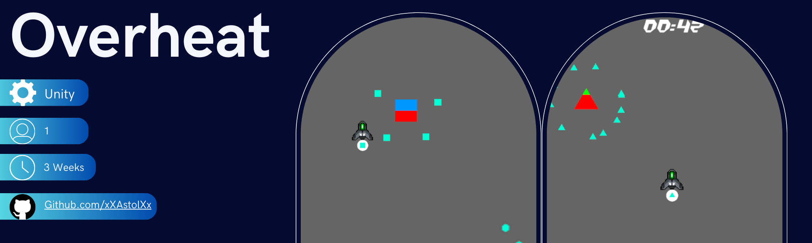

# Overheat

## Overview
**Is a 2D simplistic Game where you need to constantly refill the Buildings with coolant that reduces the buildings Heat.**
 
My purpose was to learn how to use the Odin Inspector and how Scriptable Objects can be utilized. In addition, I wanted to understand the amount of UI that is required for a game to work.
## Content
- Scriptable Objects are utilized in the generation of structures.
- Save and load your hard-earned credits
- Minimalistic user interface 
## Highlight
- [The Building Logic behind the Scriptable Objects](
